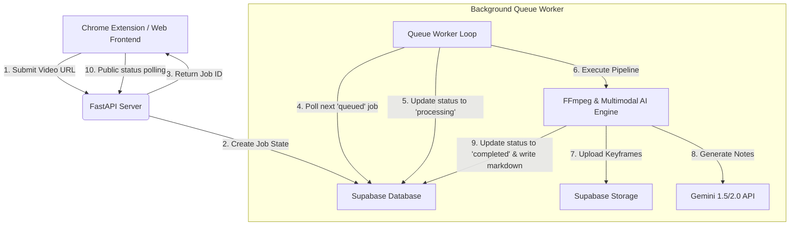

# Lecture Notes Scribe

A cloud-native, asynchronous pipeline and browser extension that processes lecture videos to generate comprehensive, textbook-quality study guides with LaTeX math equations and inline keyframe illustrations.

[](https://www.python.org/)
[](https://fastapi.tiangolo.com/)
[](https://supabase.com/)
[](https://ai.google.dev/)
[](https://developer.chrome.com/docs/extensions/mv3/)

<br />

## System Architecture

Lecture Notes Scribe is designed to handle long-running, resource-intensive video processing tasks in distributed, ephemeral cloud environments. Rather than blocking the web server during execution, the application uses a decoupled state-machine model.



### Decoupled Execution Model
Web hosting platforms like Render or Heroku terminate connections that run longer than 30 seconds. To circumvent this, submissions are processed asynchronously:
1. The user submits a video URL.
2. The server creates a entry in the Supabase database with a status of `queued` and immediately returns a `job_id`.
3. A background queue worker polls Supabase, locking and processing jobs sequentially.
4. The client polls a public endpoint at `/api/status/{job_id}` to retrieve progress updates and the final compiled markdown.

### Environmental Hardening
* **Bypassing Ephemeral Storage Loss:** All generated keyframes and static media are immediately uploaded to a Supabase bucket (`lecture_media`). Links inside the generated notes are dynamically rewritten to target permanent cloud public URLs.
* **Non-Blocking ASGI Event Loop:** Heavy, synchronous database and file-system operations are executed in dedicated thread pools via `asyncio.to_thread` to prevent thread starvation and freeze-ups.
* **Zombie Subprocess Prevention:** Background FFmpeg tasks are wrapped in strict 600-second `asyncio.wait_for` timeout blocks, ensuring that failed or hanging operations are automatically terminated.
* **Manifest V3 Resiliency:** The browser extension offloads polling requests to `chrome.alarms` in background service workers. If the user clicks away or closes the popup, the extension continues tracking the job and fires system-level OS notifications upon completion.

<br />

## Tech Stack

* **Backend:** FastAPI (Python), Uvicorn ASGI Server
* **Database & Cloud Storage:** Supabase (PostgreSQL & S3-Compatible Storage)
* **AI Processing:** Google Gemini API (Multimodal Engine)
* **Media Handling:** FFmpeg (Subprocess Audio & Keyframe Extraction), yt-dlp
* **Frontend:** Vanilla HTML, CSS (featuring Modern Typography & HSL gradients), and JS (Marked.js, MathJax)
* **Browser Integration:** Google Chrome Extension API (Manifest V3)

<br />

## Supabase Database Setup

To configure your database, go to the **SQL Editor** in your Supabase Dashboard and run the following schema script:

```sql
create table public.jobs (
  job_id text primary key,
  status text not null default 'queued',
  progress integer not null default 0,
  message text,
  url text,
  markdown text,
  html text,
  created_at timestamp with time zone default timezone('utc'::text, now()) not null
);

-- Enable Row Level Security (RLS)
alter table public.jobs enable row level security;

-- Allow complete service_role bypass access
create policy "Allow all access to service_role" 
on public.jobs 
for all 
using (true) 
with check (true);
```

### Storage Bucket Setup
1. Open the **Storage** dashboard in Supabase.
2. Create a new bucket named `lecture_media`.
3. Set the bucket privacy toggle to **Public** (required to load image paths in the rendered markdown).

<br />

## Environment Variables

When deploying the backend (e.g., to Render), configure the following environment variables:

| Variable | Description | Source |
| :--- | :--- | :--- |
| `GEMINI_API_KEY` | Google Gemini developer key | [Google AI Studio](https://aistudio.google.com/) |
| `SUPABASE_URL` | Your Supabase project URL | Project Settings -> API |
| `SUPABASE_KEY` | Supabase API authentication key | Project Settings -> API -> **`service_role`** key |
| `API_KEY` | Custom authentication secret | Any secure custom string |

> [!IMPORTANT]
> The `SUPABASE_KEY` must be the **`service_role` (secret)** key rather than the public `anon` key. The worker requires administrative database bypass privileges to update state and upload binary frames to your storage bucket.

<br />

## Local Development

### 1. Backend Server Setup
1. Clone the repository and navigate to the project directory:
   ```bash
   git clone https://github.com/Sayanthegamer/lecture-notes-pipeline.git
   cd lecture-notes-pipeline
   ```
2. Create a virtual environment and install dependencies:
   ```bash
   python -m venv .venv
   source .venv/bin/activate  # On Windows: .venv\Scripts\activate
   pip install -r requirements.txt
   ```
3. Set your environment variables in your terminal shell or create a `.env` file in the root directory.
4. Run the FastAPI server:
   ```bash
   uvicorn main:app --reload
   ```

### 2. Loading the Chrome Extension
1. Open Google Chrome and navigate to `chrome://extensions/`.
2. Enable **Developer mode** using the toggle in the top-right corner.
3. Click **Load unpacked** in the top-left corner.
4. Select the `extension/` directory from this project.
5. Click the Extension icon, open the options page, and save your backend API URL and your custom `API_KEY`.

<br />

## API Endpoints

* **`POST /api/generate`**: Submits a video url to start a background job. Requires header `X-API-Key`.
* **`POST /api/generate-from-capture`**: Submits raw visual images captured from the extension overlay. Requires header `X-API-Key`.
* **`GET /api/status/{job_id}`**: Retrieves the live execution status, logs, progress percentage, and final markdown output. *Public endpoint (No authentication required)*.
* **`GET /health`**: Standard server health check.
